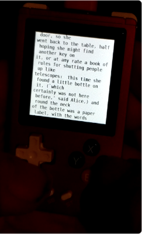
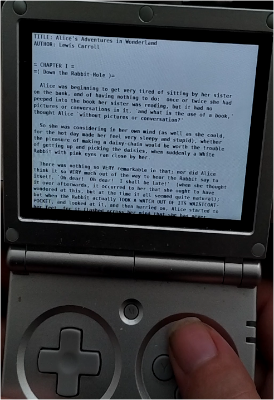
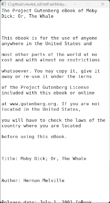
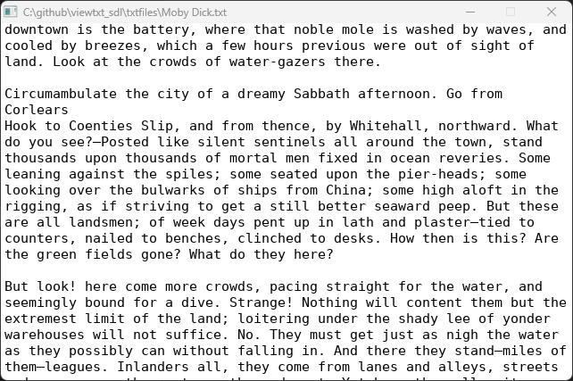

# viewtxt (SDL 1.2)
   

viewtxt is a simple SDL 1.2 txt file viewer mainly made to be used on devices like the funkey, rg nano, rg35xx line etc (chinese emulation handhelds).
you can use it for example with the txt file books from [project gutenberg](https://www.gutenberg.org/). 

## Features

* Has Layouts to reflow txt files so it matches the width of the screen both expanding and contracting or it can also just display the original txt file formatting.
* You can define (default) options in a config file (see [example.conf](example.conf)) or override all defaults on commandline. 
* Remembers font size, view layout, inverted colors and bookmark position per file and fontfile used.
* Uses dejavu font by default but can override with own font
* Supports UTF-8 text files


## Screenshots





## Using viewtxt

```
viewtxt <text_file> [-conf=path/to/config] [font_path] [font_size] [bg_r,g,b] [text_r,g,b] [encoding] [-ignore_linebreaks] [-inverted_colors] [-fullscreen] [-w=width] [-h=height]

  text_file:          Path to the text file to display (required)
  -conf=path:         Optional configuration file path
  font_path:          Path to TTF font file
  font_size:          Default value for font size
  bg_r,g,b:           Background color RGB values 0-255
  text_r,g,b:         Text color RGB values 0-255
  encoding:           Text file encoding (e.g., UTF-8, ISO-8859-1)
  -ignore_linebreaks: Default value for Ignore original line breaks and fill window width
  -inverted_colors:   Default value for inverted (switched bg & text color)
  -fullscreen:        Display the viewer fullscreen
  -w=width:           Use width for window width
  -h=height:          Use height for window height
```

## Retro fe / Gmenu2x files for Funkey / RG Nano
on funkey the viewer can be used as a opk file (in gmenu2x) where selecting the opk will display a file selection dialog, or with a seperate binary for retrofe

### Retro fe
in the meta zip file the files for adding the viewer to retrofe are included please read the included `retrofe_installation.txt` on how todo this

### Gemnu2x
Please place the `viewtxt.opk` in `Applications` folder and launch from gmenu2x

## Controls Keyboard
- UP: Scroll 1 line up
- DOWN: Scroll 1 line down
- PAGE_UP: Scroll 1 screen / page up
- PAGE_DOWN: Scroll 1 screen / page down
- HOME: Jump to start
- END: Jump to end
- A: Increase font size by 1
- B: Decrease font size by 1
- Y: Switch reflowing layouts
- X: Swap background and text color
- ESC: Quit viewer

## Controls Funkey / RG Nano
- UP: Scroll 1 line up
- DOWN: Scroll 1 line down
- L: Scroll 1 screen / page up
- R: Scroll 1 screen / page down
- SELECT: Jump to start
- START: Jump to end
- A: Increase font size by 1
- B: Decrease font size by 1
- Y: Switch reflowing layouts
- X: Swap background and text color
- MENU/POWER: Quit viewer

## Credits
* Initial Viewer created by help from claude ai and adapted by me joyrider3774